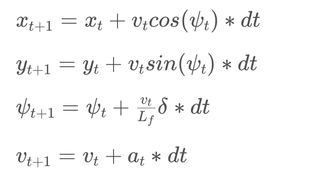

# CarND-Controls-MPC
Self-Driving Car Engineer Nanodegree Program

---

# Model in details: 
The states in my implementation includes: 
  * position (x, y coordinates), 
  * orientation, 
  * speed
  * cte: deviation of vehicle from trajectory
  * err_psi: deviation of vehicle orientation from the tangent of the trajectory.

Actuators:
  * steering angle
  * acceleration (gas pedal )

Update equations follows the Global Kinematic Model:

Implemented in Line111-115 of MPC.cpp

where `\delta` is the steering angle component in the actuator, and `a_t` is the acceleration component of the actuator.

The 1st and 2nd equations gives the position in the next timestamp. The 4th equation determines the speed at the next timestamp. These are standard motion equation of point. The 3rd equation is from the physics of a rigid body.

# Polynomial Fitting

 It is reasonable to assume acuators are linear in time. When acceleration changes linear in time, then position is a 3rd order polynomial in time. Similarly for rotation.

# Choice of Timestep Length N and Elapsed Duration dt

There is a minimum requirement for N to determine a polynomial with degree 3 (at least 4 points are needed). I started with 10 just to have a nice number. I chose dt=0.1 so that the look ahead time will be 1 second. Another reason I chose dt=0.1 is related to latency.

This actually worked well. So I start to reduce N to save some computation. When N=8, the controller is still working well.

# Latency	

Since the latency is 0.1 second which equals to my choice of dt, I used the sum of MPC calculated actuators at 0 and dt as the actual actuators for steering and acceleration. (Line 257-258 in MPC.cpp)

# The Video
